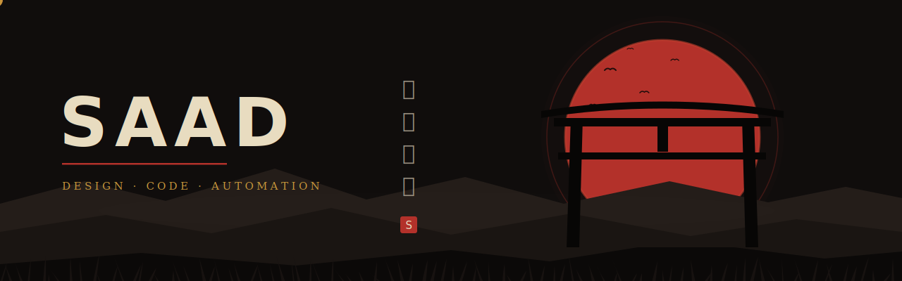

<div align="center">

<picture>
  <source media="(prefers-color-scheme: dark)" srcset="assets/banner-dark.svg">
  <source media="(prefers-color-scheme: light)" srcset="assets/banner-light.svg">
  
</picture>

<picture>
  <source media="(prefers-color-scheme: dark)" srcset="assets/tagline-dark.svg">
  <source media="(prefers-color-scheme: light)" srcset="assets/tagline-light.svg">
  
</picture>

<br/>

<a href="https://instagram.com/saad_lab.0"></a>
&nbsp;<a href="mailto:saadlabri123@gmail.com"></a>
&nbsp;
&nbsp;

</div>

<br/>

<picture>
  <source media="(prefers-color-scheme: dark)" srcset="assets/divider-dark.svg">
  <source media="(prefers-color-scheme: light)" srcset="assets/divider-light.svg">
  
</picture>

## 侍 &nbsp;whoami

```ts
const saad = {
  role: ["Product Designer", "Full-Stack Dev", "AI Automation Engineer"],
  studying: "Industrial Engineering — shipping 40+ projects on the side",
  building: [
    "FreelanceHub — Maghreb ⇄ France freelance marketplace",
    "RS — conversation-management SaaS",
  ],
  automation: "100+ n8n workflows · multi-agent pipelines",
  designPhilosophy: "if it needs a manual, redesign it",
  motto: "fall seven times, rise eight",
};
```

## 刀 &nbsp;the arsenal

**Design** &nbsp;


**Frontend** &nbsp;


**Backend** &nbsp;


**AI & Automation** &nbsp;


**Commerce** &nbsp;


## 戦 &nbsp;battle record

<div align="center">

<picture>
  <source media="(prefers-color-scheme: dark)" srcset="https://github-readme-stats.vercel.app/api?username=SaadLab06&show_icons=true&include_all_commits=true&count_private=true&hide_border=true&bg_color=00000000&title_color=C9973B&icon_color=B3312A&text_color=A79E8C&ring_color=B3312A">
  <source media="(prefers-color-scheme: light)" srcset="https://github-readme-stats.vercel.app/api?username=SaadLab06&show_icons=true&include_all_commits=true&count_private=true&hide_border=true&bg_color=00000000&title_color=8A2019&icon_color=B3312A&text_color=57503F&ring_color=B3312A">
  
</picture>
<picture>
  <source media="(prefers-color-scheme: dark)" srcset="https://streak-stats.demolab.com?user=SaadLab06&hide_border=true&background=00000000&stroke=00000000&ring=B3312A&fire=C9973B&currStreakNum=E8DCC0&sideNums=A79E8C&currStreakLabel=C9973B&sideLabels=8A8578&dates=6B6459">
  <source media="(prefers-color-scheme: light)" srcset="https://streak-stats.demolab.com?user=SaadLab06&hide_border=true&background=00000000&stroke=00000000&ring=B3312A&fire=B3312A&currStreakNum=1E1913&sideNums=57503F&currStreakLabel=8A2019&sideLabels=6B5F4A&dates=8A8578">
  
</picture>

<picture>
  <source media="(prefers-color-scheme: dark)" srcset="https://github-readme-stats.vercel.app/api/top-langs/?username=SaadLab06&layout=compact&langs_count=10&hide_border=true&bg_color=00000000&title_color=C9973B&text_color=A79E8C">
  <source media="(prefers-color-scheme: light)" srcset="https://github-readme-stats.vercel.app/api/top-langs/?username=SaadLab06&layout=compact&langs_count=10&hide_border=true&bg_color=00000000&title_color=8A2019&text_color=57503F">
  
</picture>

</div>

## 蛇 &nbsp;the serpent devours the year

<div align="center">
<picture>
  <source media="(prefers-color-scheme: dark)" srcset="https://raw.githubusercontent.com/SaadLab06/SaadLab06/output/snake-dark.svg">
  <source media="(prefers-color-scheme: light)" srcset="https://raw.githubusercontent.com/SaadLab06/SaadLab06/output/snake.svg">
  
</picture>
</div>

<br/>

<picture>
  <source media="(prefers-color-scheme: dark)" srcset="assets/divider-dark.svg">
  <source media="(prefers-color-scheme: light)" srcset="assets/divider-light.svg">
  
</picture>

<div align="center">

<br/>

*「迷えば、敗れる」*

<sub>hesitation is defeat</sub>

<picture>
  <source media="(prefers-color-scheme: dark)" srcset="assets/footer-dark.svg">
  <source media="(prefers-color-scheme: light)" srcset="assets/footer-light.svg">
  
</picture>

</div>
